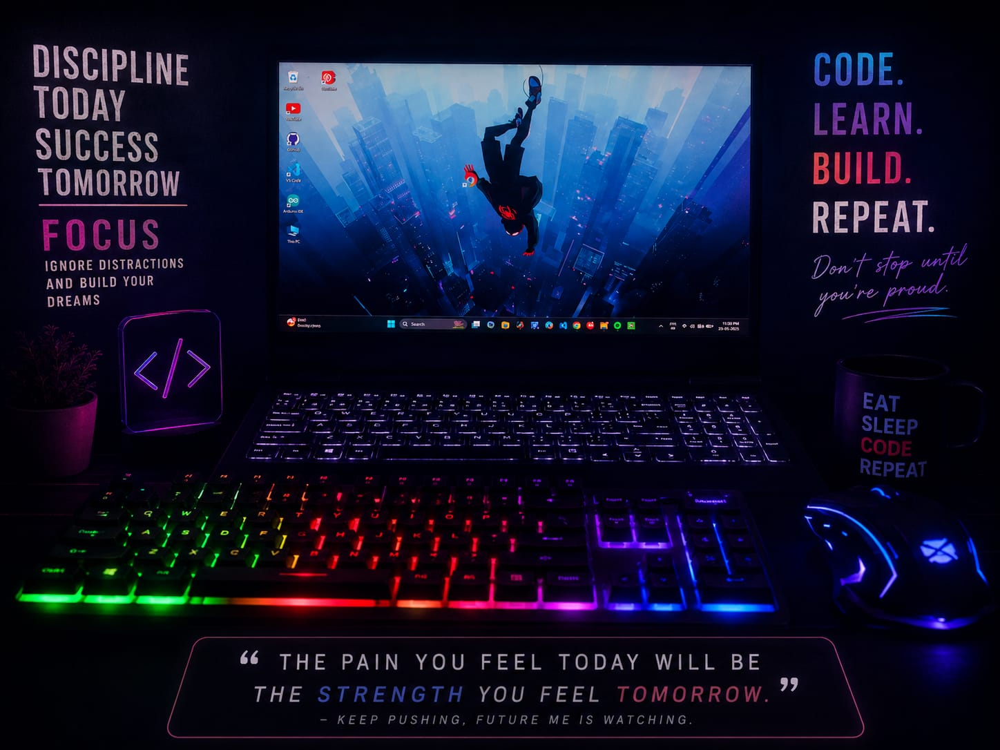

<h1 align="center">
  Namaste 🙏</h1><h3 align="center">
  I'm Pritam Roy</h2
                    3>
<h3 align="center">Creative Developer • Learner • Tech Explorer</h3>

  

---

### 🧠 About Me
- 💻 I enjoy **coding, animation & creative projects**
- 🎨 Love mixing **art + tech**
- 🔌 Electrical Engineering student 
- 🔌Interest in **IoT / Embedded:** ESP32, Arduino  
- 🐍 Currently learning **Python, C & C++**
- 🚀 Learning by building practical projects
- 😴 Introvert, overthinker & idea generator
- 💤 ঘুম ভালোবাসি  
(*Sleep > Work. Always.* 😌)
---

### 💻 Tech Stack

---
### 🔧 IoT Tech Stack

  

- 🔌 **Microcontrollers:** ESP32, Arduino  
- 🧠 **Programming:** C, C++, Python  
- 🛠️ **Tools:** Arduino IDE, VS Code, GitHub  

---

### 🧯It Worked Yesterday

  

---

### 🌐 Connect With Me

  
  
  

---

### 🐍 Contribution Snake
<picture>
  <source media="(prefers-color-scheme: dark)" srcset="./dist/github-contribution-grid-snake-dark.svg">
  
</picture>

---

  ⚡ “Code. Create. Improve. Repeat.” ⚡

